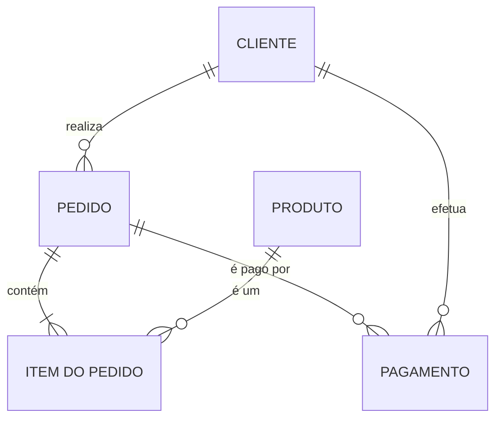
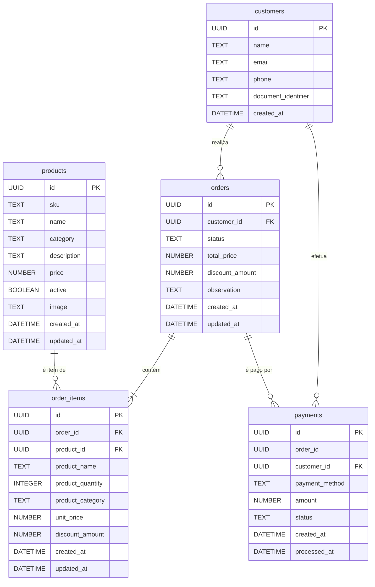
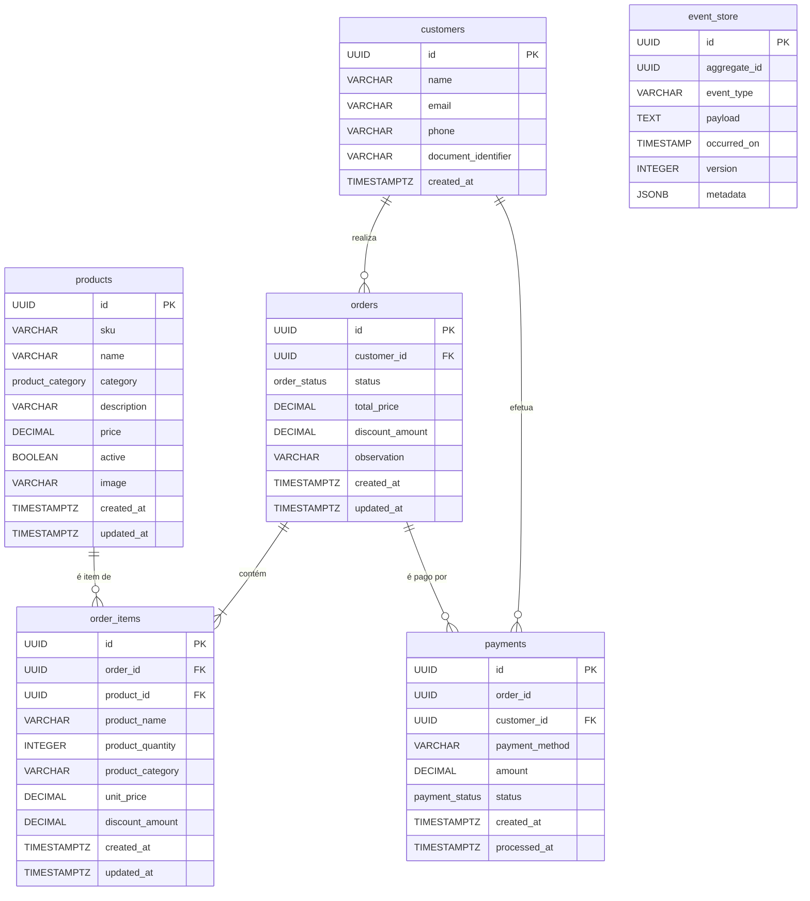

# Documentação do Banco de Dados - Tech Challenge SOAT

Este documento detalha a arquitetura, a modelagem e as justificativas técnicas para a estrutura do banco de dados utilizado no projeto de gestão para a rede de fast-food.

---

## 1. Justificativa da Escolha: PostgreSQL no AWS RDS

A escolha do **PostgreSQL** como sistema de gerenciamento de banco de dados (SGBD), hospedado no serviço **AWS RDS (Relational Database Service)**, é uma decisão estratégica que alinha robustez, flexibilidade e eficiência operacional para a aplicação.

### a. Natureza Relacional e Transacional dos Dados
O núcleo da aplicação envolve transações complexas e dados altamente interconectados: clientes realizam pedidos, que contêm itens e geram pagamentos.

* **Integridade e Consistência (ACID):** O PostgreSQL garante as propriedades ACID (Atomicidade, Consistência, Isolamento e Durabilidade), o que é indispensável para operações financeiras e de controle de pedidos.
* **Relacionamentos Claros:** A estrutura de tabelas com chaves estrangeiras (`customers`, `orders`, `order_items`) se beneficia diretamente do modelo relacional, assegurando que um pedido sempre pertença a um cliente válido.

### b. Flexibilidade e Recursos Avançados do PostgreSQL
O PostgreSQL é um sistema objeto-relacional que oferece suporte a tipos de dados avançados, adequados às necessidades da aplicação.

* **Suporte a JSONB:** A tabela `event_store`, utilizada para Event Sourcing, se beneficia do tipo de dado `JSONB`, que permite armazenar e consultar dados de `payload` de forma eficiente.
* **Tipos de Dados Customizáveis:** O uso de tipos `ENUM` para `order_status` e `payment_status` garante a consistência e a validação dos dados diretamente no banco.

### c. Vantagens do AWS RDS (Serviço Gerenciado)
Provisionar o PostgreSQL através do AWS RDS abstrai a complexidade da infraestrutura e oferece benefícios operacionais cruciais.

* **Gerenciamento Simplificado:** A AWS automatiza tarefas como provisionamento de infraestrutura, atualizações de S.O., backups e alta disponibilidade.
* **Escalabilidade:** O RDS facilita a escalabilidade vertical (alterando a `instance_class`) e de armazenamento, adaptando-se ao crescimento da demanda.
* **Segurança:** A infraestrutura é provisionada em sub-redes privadas e protegida por `Security Groups`, garantindo que o banco de dados не seja exposto à internet. A gestão de senhas com AWS Secrets Manager complementa a estratégia de segurança.

---

## 2. Modelagem e Documentação de Dados

A seguir, a documentação do banco de dados em seus três níveis de abstração.

### a. Modelo Conceitual
Este modelo foca nas entidades de negócio e seus relacionamentos de alto nível.

### b. Modelo Lógico
Este modelo detalha as entidades com atributos e chaves, usando tipos de dados genéricos.

### c. Modelo Físico
Este modelo representa a implementação exata no PostgreSQL, conforme definido pelos scripts do Flyway.

