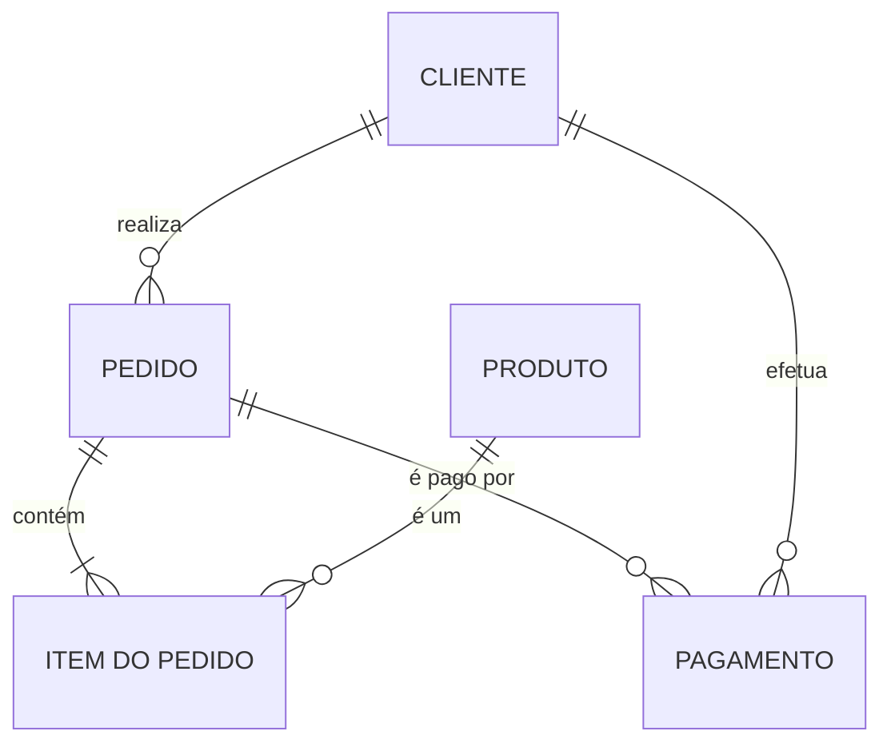
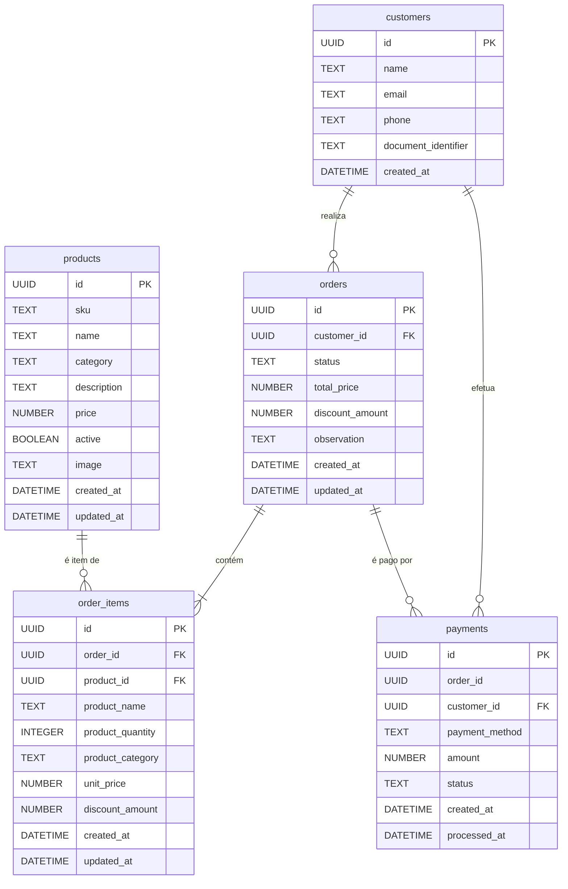
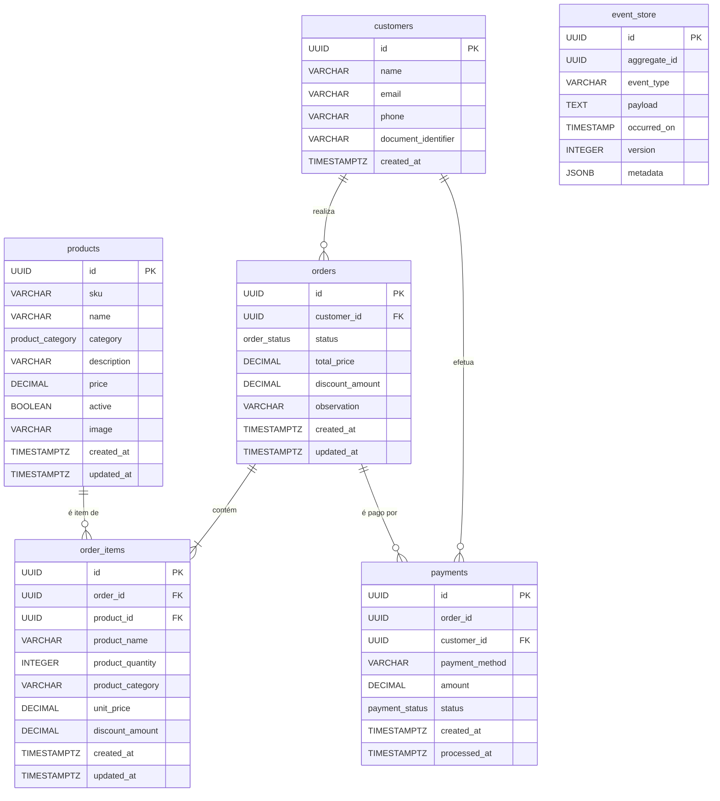

# Documentação do Banco de Dados - Tech Challenge SOAT

Este documento detalha as justificativas técnicas, a modelagem dos dados e as melhorias nas tabelas para a estrutura do banco de dados utilizado no projeto de gestão para a rede de fast-food.

---

## 1. Justificativa da Escolha: PostgreSQL no AWS RDS

A escolha do **PostgreSQL** como sistema de gerenciamento de banco de dados (SGBD), hospedado no serviço **AWS RDS (Relational Database Service)**, é uma decisão estratégica que alinha robustez, flexibilidade e eficiência operacional para a aplicação.

### a. Natureza Relacional e Transacional dos Dados
O núcleo da aplicação envolve transações complexas e dados altamente interconectados: clientes realizam pedidos, que contêm itens e geram pagamentos.

* **Integridade e Consistência (ACID):** O PostgreSQL garante as propriedades ACID (Atomicidade, Consistência, Isolamento e Durabilidade), o que é indispensável para operações financeiras e de controle de pedidos.
* **Relacionamentos Claros:** A estrutura de tabelas com chaves estrangeiras (`customers`, `orders`, `order_items`) se beneficia diretamente do modelo relacional, assegurando que um pedido sempre pertença a um cliente válido.

### b. Flexibilidade e Recursos Avançados do PostgreSQL
O PostgreSQL é um sistema objeto-relacional que oferece suporte a tipos de dados avançados, adequados às necessidades da aplicação.

* **Suporte a JSONB:** A tabela `event_store`, utilizada para Event Sourcing, se beneficia do tipo de dado `JSONB`, que permite armazenar e consultar dados de `payload` de forma eficiente.
* **Tipos de Dados Customizáveis:** O uso de tipos `ENUM` para `order_status` e `payment_status` garante a consistência e a validação dos dados diretamente no banco.

### c. Vantagens do AWS RDS (Serviço Gerenciado)
Provisionar o PostgreSQL através do AWS RDS abstrai a complexidade da infraestrutura e oferece benefícios operacionais cruciais.

* **Gerenciamento Simplificado:** A AWS automatiza tarefas como provisionamento de infraestrutura, atualizações de S.O., backups e alta disponibilidade.
* **Escalabilidade:** O RDS facilita a escalabilidade vertical (alterando a `instance_class`) e de armazenamento, adaptando-se ao crescimento da demanda.
* **Segurança:** A infraestrutura é provisionada em sub-redes privadas e protegida por `Security Groups`, garantindo que o banco de dados não seja exposto à internet. A gestão de senhas com AWS Secrets Manager complementa a estratégia de segurança.

---

## 2. Modelagem e Documentação de Dados

A seguir, a documentação do banco de dados em seus três níveis de abstração.

### a. Modelo Conceitual
Este modelo foca nas entidades de negócio e seus relacionamentos de alto nível.

### b. Modelo Lógico
Este modelo detalha as entidades com atributos e chaves, usando tipos de dados genéricos.

### c. Modelo Físico
Este modelo representa a implementação exata no PostgreSQL, conforme definido pelos scripts do Flyway.

---

## 3. Otimizações de Performance e Integridade

Para garantir que o banco de dados opere com alta performance e mantenha a consistência dos dados à medida que o volume de transações cresce, foram implementadas as seguintes otimizações de schema através de migrations dedicadas.

### a. Criação de Índices Estratégicos (`V202510022140__add_performance_indexes.sql`)

**Problema:** Consultas que filtram ou ordenam dados em colunas não indexadas forçam o banco de dados a realizar uma varredura completa da tabela (*Full Table Scan*). Isso é extremamente custoso e lento, especialmente em tabelas como `orders` e `payments`.

**Solução:** Foram adicionados índices B-Tree nas colunas mais utilizadas em cláusulas `WHERE` e `JOIN`, permitindo que o banco de dados localize os registros de forma quase instantânea.

**Índices Adicionados:**
* `CREATE INDEX idx_orders_status ON orders (status);`
    * **Justificativa:** Acelera drasticamente a consulta da fila de pedidos da cozinha, que filtra constantemente por status (`RECEIVED`, `IN_PREPARATION`, `DONE`).
* `CREATE INDEX idx_orders_customer_id ON orders (customer_id);`
    * **Justificativa:** Otimiza a busca de todos os pedidos de um cliente específico.
* `CREATE INDEX idx_order_items_product_id ON order_items (product_id);`
    * **Justificativa:** Melhora a performance ao buscar todos os pedidos que contêm um determinado produto.
* `CREATE INDEX idx_payments_order_id ON payments (order_id);` e `CREATE INDEX idx_payments_customer_id ON payments (customer_id);`
    * **Justificativa:** Aceleram a busca de pagamentos associados a um pedido ou a um cliente.

### b. Adição de Constraints de Chave Estrangeira (`V202510022145__add_foreign_key_constraints.sql`)

**Problema:** Sem a imposição de integridade referencial, seria possível, por exemplo, ter um registro de pagamento para um pedido que não existe mais, gerando "dados órfãos" e inconsistências no sistema. Além disso, o otimizador de consultas do PostgreSQL utiliza essas `constraints` para elaborar planos de execução mais eficientes.

**Solução:** Foram aplicadas `FOREIGN KEY constraints` para garantir que os relacionamentos entre as tabelas sejam sempre válidos.

**Constraints Adicionadas:**
* **`orders` e `customers`:** Garante que um `customer_id` na tabela `orders` sempre corresponda a um `id` válido na tabela `customers`.
* **`order_items` e `products`:** Assegura que um `product_id` em `order_items` sempre aponte para um produto existente.
* **`payments` com `orders` e `customers`:** Garante que cada pagamento esteja corretamente vinculado a um pedido e a um cliente existentes no banco de dados.

Essas melhorias transformam o banco de dados de uma estrutura funcional para uma estrutura robusta, performática e pronta para escalar.

### c. Habilitação do AWS Performance Insights (Infraestrutura via Terraform)

**Problema:** Identificar a causa raiz de gargalos de performance em um banco de dados pode ser um processo complexo. Sem uma ferramenta de análise visual, é difícil saber quais consultas SQL estão consumindo mais tempo, quais "eventos de espera" (`wait events`) estão atrasando as operações e como a carga no banco está distribuída ao longo do tempo.

**Solução:** Foi habilitado o **AWS Performance Insights**, uma ferramenta de monitoramento avançado de performance para o Amazon RDS. Ele fornece um painel visual que permite analisar a carga do banco de dados e identificar rapidamente as consultas mais lentas e outros gargalos, facilitando o diagnóstico e a resolução de problemas de performance.

**Ação Concreta:** No arquivo de infraestrutura como código `rds.tf`, a instância do RDS foi configurada com o parâmetro `performance_insights_enabled = true`. Isso instrui a AWS a provisionar a instância com essa funcionalidade de monitoramento ativada por padrão, garantindo visibilidade sobre a performance desde o primeiro dia.